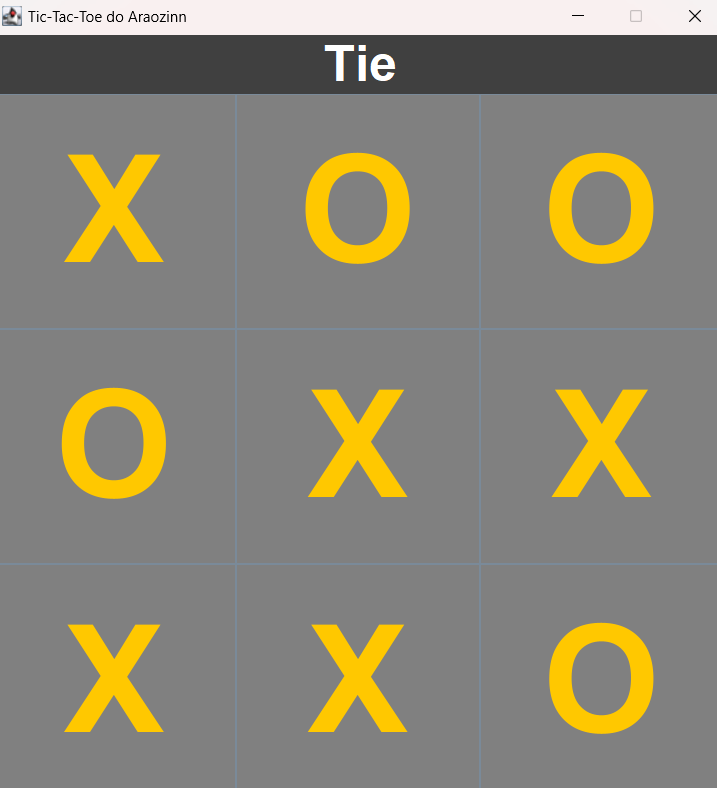

# Tic-Tac-Toe Game

This is a Tic-Tac-Toe game developed in Java using GUI components from the AWT and Swing libraries. The game provides an interactive and visually appealing interface for two players to enjoy the classic Tic-Tac-Toe experience.

## Features

- **Interactive Gameplay**: Players take turns clicking on the grid to place their markers ('X' or 'O').
- **Dynamic Winner Highlight**: Highlights the winning row, column, or diagonal with a distinct color when a player wins.
- **Tie Detection**: Detects when the game ends in a draw and notifies the players.
- **User-Friendly Design**: Clean and modern UI for easy interaction.

## How to Play

1. Run the program in any Java-supported environment.
2. The game starts with Player 'X' making the first move.
3. Players alternate turns by clicking on empty cells in the grid.
4. The game declares a winner when one player successfully aligns three of their markers in a row, column, or diagonal.
5. If all cells are filled and no player has aligned three markers, the game ends in a tie.

## Screenshots

### Initial Interface

The game starts with an empty grid ready for players:


### Winning State

When a player wins, the winning sequence is highlighted:

- **Player O Wins**:


- **Player X Wins**:


### Tie State

If the grid is filled and no one wins, the game ends in a tie:



## Technologies Used

- **Java**: For logic and backend functionality.
- **AWT and Swing Libraries**: To create the graphical user interface.

## Installation

1. Clone this repository:
   ```bash
   git clone <repository-url>
   ```
2. Navigate to the project directory and compile the Java files:
   ```bash
   javac *.java
   ```
3. Run the program:
   ```bash
   java Main
   ```

## Future Enhancements

- Add a restart button to reset the game without restarting the program.
- Implement AI for single-player mode.
- Enhance the UI with animations and sound effects.

## Acknowledgments

Thanks to the AWT and Swing libraries for providing the tools to build this project. 

